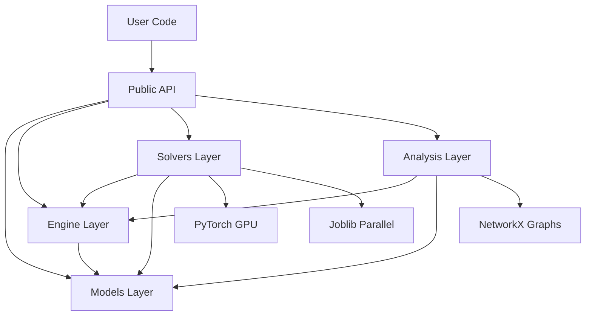
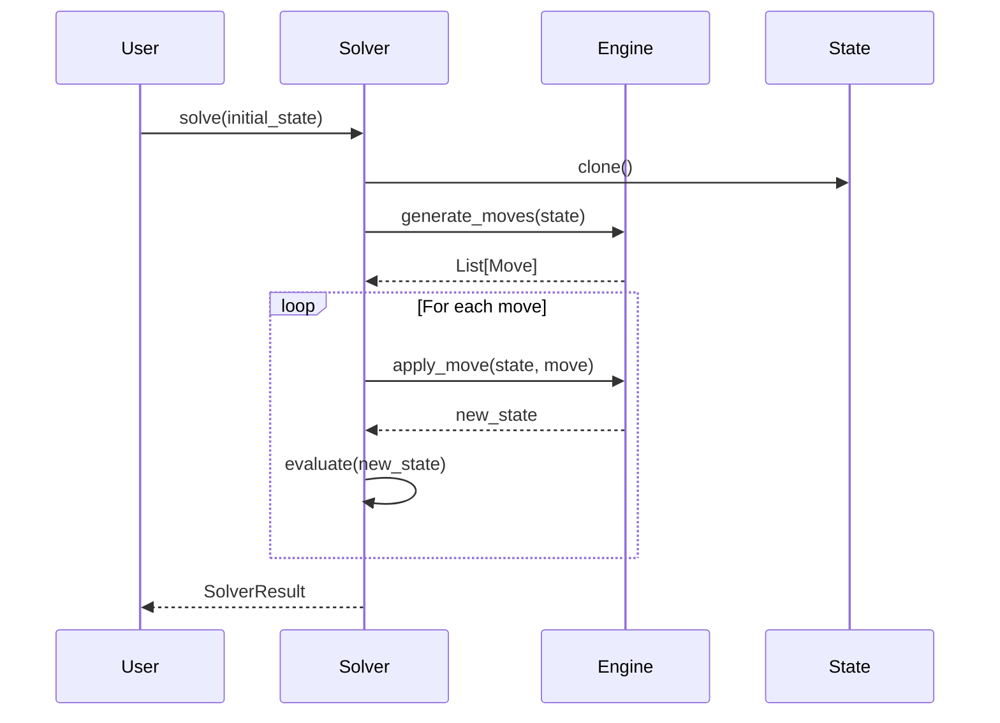
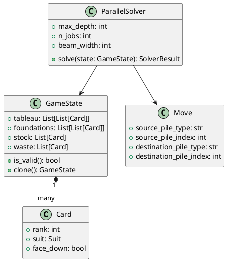

# Coding Agent Tasks - Documentation Improvements

**Date:** November 13, 2025  
**Category:** Documentation  
**Difficulty Range:** Easy to Medium

## Overview

This document contains self-contained documentation tasks suitable for coding agents. Each task improves project documentation and user experience.

---

## Task 1: Create API Reference with Sphinx

**Difficulty:** Medium  
**Estimated Time:** 4-6 hours  
**Module:** `docs/api/`

### Description
Set up Sphinx for automatic API documentation generation from docstrings.

### Context
Automated API documentation ensures docs stay in sync with code.

### Requirements
1. Install and configure Sphinx
2. Set up autodoc extension
3. Generate API documentation
4. Configure ReadTheDocs-style theme
5. Add to CI pipeline

### Acceptance Criteria
- [ ] Sphinx installed and configured
- [ ] `docs/` directory created with structure
- [ ] API docs generate successfully
- [ ] HTML output looks professional
- [ ] Documentation builds in CI
- [ ] README updated with docs link

### Setup Steps

1. **Install Sphinx**
```bash
pip install sphinx sphinx-rtd-theme sphinx-autodoc-typehints
```

2. **Initialize Sphinx**
```bash
mkdir -p docs
cd docs
sphinx-quickstart
```

3. **Configure** `docs/conf.py`:
```python
import os
import sys
sys.path.insert(0, os.path.abspath('..'))

project = 'Solitaire Analytics'
copyright = '2025, Solitaire Analytics Team'
author = 'Solitaire Analytics Team'
version = '0.1.0'

extensions = [
    'sphinx.ext.autodoc',
    'sphinx.ext.napoleon',  # Google/NumPy style docstrings
    'sphinx.ext.viewcode',  # Source code links
    'sphinx.ext.intersphinx',  # Links to other docs
    'sphinx_autodoc_typehints',  # Type hint support
]

templates_path = ['_templates']
exclude_patterns = ['_build', 'Thumbs.db', '.DS_Store']

html_theme = 'sphinx_rtd_theme'
html_static_path = ['_static']

autodoc_member_order = 'bysource'
autodoc_typehints = 'description'
```

4. **Create** `docs/index.rst`:
```rst
Solitaire Analytics Documentation
==================================

.. toctree::
   :maxdepth: 2
   :caption: Contents:

   quickstart
   api/index
   examples
   contributing

Welcome to Solitaire Analytics
------------------------------

A Python 3.12 analytics engine for Solitaire games.

.. code-block:: python

   from solitaire_analytics import GameState, generate_moves

   state = GameState()
   moves = generate_moves(state)

Indices and tables
==================

* :ref:`genindex`
* :ref:`modindex`
* :ref:`search`
```

5. **Create** `docs/api/index.rst`:
```rst
API Reference
=============

.. toctree::
   :maxdepth: 2

   models
   engine
   solvers
   analysis

Models
------

.. automodule:: solitaire_analytics.models
   :members:
   :undoc-members:
   :show-inheritance:

Engine
------

.. automodule:: solitaire_analytics.engine
   :members:
   :undoc-members:
   :show-inheritance:

Solvers
-------

.. automodule:: solitaire_analytics.solvers
   :members:
   :undoc-members:
   :show-inheritance:

Analysis
--------

.. automodule:: solitaire_analytics.analysis
   :members:
   :undoc-members:
   :show-inheritance:
```

6. **Build Documentation**
```bash
cd docs
make html
# Open _build/html/index.html in browser
```

7. **Add to CI** (`.github/workflows/docs.yml`):
```yaml
name: Documentation

on:
  push:
    branches: [main]
  pull_request:

jobs:
  build-docs:
    runs-on: ubuntu-latest
    steps:
      - uses: actions/checkout@v3
      - uses: actions/setup-python@v4
        with:
          python-version: '3.12'
      - name: Install dependencies
        run: |
          pip install -r requirements.txt
          pip install sphinx sphinx-rtd-theme
      - name: Build docs
        run: |
          cd docs
          make html
      - name: Upload docs
        uses: actions/upload-artifact@v3
        with:
          name: documentation
          path: docs/_build/html
```

### Files to Create
- `docs/conf.py`
- `docs/index.rst`
- `docs/api/index.rst`
- `docs/quickstart.rst`
- `docs/Makefile`
- `.github/workflows/docs.yml`

### Verification
```bash
cd docs
make html
make linkcheck  # Check for broken links
```

---

## Task 2: Write Comprehensive Tutorial

**Difficulty:** Easy-Medium  
**Estimated Time:** 4-5 hours  
**Module:** `docs/tutorial.md`

### Description
Create a step-by-step tutorial covering basic to advanced usage.

### Context
A good tutorial helps new users get started quickly and understand best practices.

### Requirements
Tutorial sections:
1. Installation
2. Basic concepts
3. Creating game states
4. Generating and validating moves
5. Using the solver
6. Building move trees
7. Analyzing games
8. Advanced topics

### Acceptance Criteria
- [ ] Tutorial file created
- [ ] All sections complete
- [ ] Code examples tested and working
- [ ] Clear progression from basic to advanced
- [ ] Screenshots/diagrams included
- [ ] Linked from README

### Example Structure

```markdown
# Solitaire Analytics Tutorial

## Introduction

This tutorial will guide you through using the Solitaire Analytics Engine,
from basic game state manipulation to advanced solving and analysis.

## Installation

```bash
pip install solitaire-analytics
```

## Part 1: Basic Concepts

### Understanding Game State

A game state represents a complete snapshot of a Solitaire game...

```python
from solitaire_analytics import GameState

state = GameState()
print(f"Tableau piles: {len(state.tableau)}")
print(f"Foundation piles: {len(state.foundations)}")
```

### Cards and Suits

...

## Part 2: Working with Moves

### Generating Moves

...

### Validating Moves

...

### Applying Moves

...

## Part 3: Solving Games

### Basic Solving

...

### Configuring the Solver

...

### Understanding Results

...

## Part 4: Analysis Tools

### Building Move Trees

...

### Detecting Dead Ends

...

### Finding Optimal Sequences

...

## Part 5: Advanced Topics

### Custom Heuristics

...

### Parallel Processing

...

### GPU Acceleration

...

## Next Steps

...
```

### Related Files
- `README.md` (add tutorial link)
- `docs/index.rst` (add tutorial to toctree)

---

## Task 3: Create Troubleshooting Guide

**Difficulty:** Easy  
**Estimated Time:** 2-3 hours  
**Module:** `docs/troubleshooting.md`

### Description
Document common issues and their solutions.

### Context
Users encounter common problems. A troubleshooting guide saves time.

### Requirements
Document issues for:
1. Installation problems
2. Import errors
3. Performance issues
4. GPU problems
5. Memory issues
6. Timeout problems

### Acceptance Criteria
- [ ] Troubleshooting guide created
- [ ] At least 10 common issues documented
- [ ] Each issue has clear solution
- [ ] Diagnostic commands included
- [ ] Linked from README

### Example Structure

```markdown
# Troubleshooting Guide

## Installation Issues

### Problem: pip install fails with "No matching distribution"

**Symptom:**
```
ERROR: Could not find a version that satisfies the requirement solitaire-analytics
```

**Cause:** Package not yet published to PyPI.

**Solution:**
Install from source:
```bash
git clone https://github.com/chayuto/solitaire-analytics.git
cd solitaire-analytics
pip install -e .
```

---

### Problem: Import error for torch

**Symptom:**
```
ImportError: No module named 'torch'
```

**Cause:** PyTorch not installed.

**Solution:**
```bash
pip install torch>=2.0.0
```

---

## Performance Issues

### Problem: Solver is very slow

**Symptoms:**
- Takes minutes to solve simple games
- High CPU usage

**Diagnosis:**
```python
from solitaire_analytics import ParallelSolver

solver = ParallelSolver(max_depth=5, n_jobs=1)
import time
start = time.time()
result = solver.solve(state)
print(f"Took {time.time() - start:.2f} seconds")
```

**Solutions:**
1. **Reduce search depth:**
   ```python
   solver = ParallelSolver(max_depth=10)  # Try 5-10 first
   ```

2. **Increase parallelism:**
   ```python
   solver = ParallelSolver(n_jobs=-1)  # Use all cores
   ```

3. **Increase beam width:**
   ```python
   solver = ParallelSolver(beam_width=200)  # Default is 100
   ```

---

### Problem: Out of memory errors

**Symptom:**
```
MemoryError: Unable to allocate array
```

**Cause:** Tree builder or solver exploring too many states.

**Solutions:**
1. **Limit tree size:**
   ```python
   builder = MoveTreeBuilder(max_nodes=500)  # Reduce from 1000
   ```

2. **Reduce beam width:**
   ```python
   solver = ParallelSolver(beam_width=50)  # Reduce from 100
   ```

---

## GPU Issues

### Problem: GPU not being used

**Diagnosis:**
```python
import torch
print(f"CUDA available: {torch.cuda.is_available()}")
print(f"CUDA device: {torch.cuda.get_device_name(0)}")
```

**Solutions:**
If CUDA not available:
1. Install CUDA-enabled PyTorch
2. Check GPU drivers
3. Use CPU fallback: `ParallelSolver(use_gpu=False)`

---

## Common Errors

### InvalidMoveError

**Cause:** Attempting an illegal move.

**Solution:** Use `validate_move()` before applying:
```python
if validate_move(move, state):
    new_state = apply_move(state, move)
else:
    print(f"Invalid move: {move}")
```

---

### InvalidStateError

**Cause:** Game state is corrupted or invalid.

**Solution:** Validate state before operations:
```python
if not state.is_valid():
    errors = state.get_validation_errors()
    print(f"State errors: {errors}")
```

---

## Getting Help

If your issue isn't covered here:

1. Check the [API documentation](docs/api/)
2. Search [existing issues](https://github.com/chayuto/solitaire-analytics/issues)
3. Ask on [discussions](https://github.com/chayuto/solitaire-analytics/discussions)
4. Open a [new issue](https://github.com/chayuto/solitaire-analytics/issues/new)

Include:
- Python version
- Package version
- Minimal code to reproduce
- Full error message
- Output of `pip list | grep -E "torch|joblib|networkx"`
```

---

## Task 4: Create Architecture Diagrams

**Difficulty:** Medium  
**Estimated Time:** 3-4 hours  
**Module:** `docs/architecture/`

### Description
Create visual diagrams explaining system architecture.

### Context
Diagrams help developers understand system structure quickly.

### Requirements
Create diagrams for:
1. High-level architecture
2. Module dependencies
3. Data flow
4. Solver algorithm flow
5. Class relationships

### Acceptance Criteria
- [ ] At least 4 diagrams created
- [ ] Mermaid or PlantUML format
- [ ] Diagrams render correctly
- [ ] Descriptions for each diagram
- [ ] Linked from documentation

### Example Diagrams

**1. High-Level Architecture (Mermaid)**
```markdown
# docs/architecture/overview.md

## System Architecture



### Components

- **Models**: Core data structures (Card, GameState, Move)
- **Engine**: Game rules and move generation
- **Solvers**: Game solving algorithms
- **Analysis**: Analytics and tree building
```

**2. Data Flow (Mermaid)**
```markdown
## Data Flow


```

**3. Class Diagram (PlantUML)**
```markdown
## Class Relationships


```

### Tools
- Mermaid: Renders in GitHub markdown
- PlantUML: More powerful, needs renderer
- draw.io: For complex diagrams

### Files to Create
- `docs/architecture/overview.md`
- `docs/architecture/data_flow.md`
- `docs/architecture/classes.md`
- `docs/architecture/solver_algorithm.md`

---

## Task 5: Write Contributing Guide

**Difficulty:** Easy  
**Estimated Time:** 2-3 hours  
**Module:** `CONTRIBUTING.md` (enhance existing)

### Description
Enhance the contributing guide with more detailed information.

### Context
Current CONTRIBUTING.md is basic. More detail helps contributors.

### Requirements
Add sections for:
1. Development setup (detailed)
2. Code style guidelines
3. Testing requirements
4. PR process
5. Review guidelines
6. Release process

### Acceptance Criteria
- [ ] CONTRIBUTING.md significantly expanded
- [ ] Clear step-by-step instructions
- [ ] Examples included
- [ ] Checklists for contributors
- [ ] Links to relevant resources

### Example Additions

```markdown
# Contributing to Solitaire Analytics Engine

Thank you for your interest in contributing!

## Table of Contents

- [Development Setup](#development-setup)
- [Code Style](#code-style)
- [Testing](#testing)
- [Pull Request Process](#pull-request-process)
- [Review Guidelines](#review-guidelines)
- [Release Process](#release-process)

## Development Setup

### Prerequisites

- Python 3.12 or higher
- Git
- pip

### Step-by-Step Setup

1. **Fork and clone the repository:**
   ```bash
   git clone https://github.com/YOUR_USERNAME/solitaire-analytics.git
   cd solitaire-analytics
   ```

2. **Create a virtual environment:**
   ```bash
   python3.12 -m venv venv
   source venv/bin/activate  # On Windows: venv\Scripts\activate
   ```

3. **Install dependencies:**
   ```bash
   pip install --upgrade pip
   pip install -e .
   pip install -r requirements-dev.txt
   ```

4. **Install pre-commit hooks:**
   ```bash
   pip install pre-commit
   pre-commit install
   ```

5. **Verify installation:**
   ```bash
   pytest -v
   python scripts/example_analysis.py
   ```

### Development Tools

We use these tools for code quality:

- **black**: Code formatting
- **isort**: Import sorting
- **flake8**: Linting
- **mypy**: Type checking
- **pytest**: Testing

### Quick Commands

```bash
# Format code
make format

# Check code quality
make lint

# Run tests
make test

# Run all checks
make check
```

## Code Style

### Python Style

We follow PEP 8 with some modifications:
- Line length: 100 characters
- Use double quotes for strings
- Use type hints for all functions

### Naming Conventions

- **Classes**: PascalCase (e.g., `GameState`)
- **Functions**: snake_case (e.g., `generate_moves`)
- **Constants**: UPPER_CASE (e.g., `MAX_DEPTH`)
- **Private**: _leading_underscore (e.g., `_internal_function`)

### Docstrings

Use Google-style docstrings:

```python
def function_name(param1: str, param2: int) -> bool:
    """One-line summary.
    
    More detailed description if needed.
    
    Args:
        param1: Description of param1.
        param2: Description of param2.
    
    Returns:
        Description of return value.
    
    Raises:
        ValueError: When and why.
    
    Example:
        >>> function_name("test", 42)
        True
    """
```

### Type Hints

Always use type hints:

```python
from typing import List, Optional

def process_cards(cards: List[Card], limit: Optional[int] = None) -> List[Card]:
    ...
```

## Testing

### Writing Tests

- Write tests for all new features
- Test both happy path and edge cases
- Use descriptive test names
- Use pytest fixtures for common setup

### Test Structure

```python
def test_feature_name_scenario():
    """Test that feature behaves correctly in specific scenario."""
    # Arrange
    state = GameState()
    
    # Act
    result = function_under_test(state)
    
    # Assert
    assert result.success
    assert len(result.data) > 0
```

### Running Tests

```bash
# All tests
pytest

# Specific file
pytest tests/test_models.py

# Specific test
pytest tests/test_models.py::test_card_creation

# With coverage
pytest --cov=solitaire_analytics

# Fast tests only
pytest -m "not slow"
```

### Test Markers

Use appropriate markers:

```python
@pytest.mark.unit
def test_card_creation():
    ...

@pytest.mark.integration
def test_solver_integration():
    ...

@pytest.mark.slow
def test_long_running():
    ...
```

## Pull Request Process

### Before Creating a PR

- [ ] All tests pass locally
- [ ] Code is formatted (black, isort)
- [ ] Linting passes (flake8)
- [ ] Type checking passes (mypy)
- [ ] Documentation updated
- [ ] CHANGELOG updated

### Creating a PR

1. Create a feature branch:
   ```bash
   git checkout -b feature/your-feature-name
   ```

2. Make your changes and commit:
   ```bash
   git add .
   git commit -m "feat: add your feature"
   ```
   
   Use [conventional commits](https://www.conventionalcommits.org/):
   - `feat:` New feature
   - `fix:` Bug fix
   - `docs:` Documentation
   - `test:` Tests
   - `refactor:` Code refactoring

3. Push to your fork:
   ```bash
   git push origin feature/your-feature-name
   ```

4. Open a PR on GitHub with:
   - Clear title
   - Description of changes
   - Related issue number
   - Screenshots (if UI changes)

### PR Template

```markdown
## Description
Brief description of changes.

## Type of Change
- [ ] Bug fix
- [ ] New feature
- [ ] Breaking change
- [ ] Documentation

## Checklist
- [ ] Tests pass
- [ ] Code formatted
- [ ] Documentation updated
- [ ] CHANGELOG updated

## Related Issues
Fixes #123
```

## Review Guidelines

### For Contributors

- Respond to review comments promptly
- Make requested changes or discuss
- Mark conversations as resolved
- Request re-review when ready

### For Reviewers

- Be constructive and respectful
- Explain the "why" behind suggestions
- Approve when satisfied
- Check:
  - [ ] Code is correct
  - [ ] Tests are adequate
  - [ ] Documentation is clear
  - [ ] No performance issues
  - [ ] Follows project style

## Release Process

1. Update version in `setup.py`
2. Update CHANGELOG
3. Create release PR
4. After merge, tag release:
   ```bash
   git tag v0.2.0
   git push origin v0.2.0
   ```
5. Create GitHub release
6. Publish to PyPI (maintainers only)

## Questions?

- Check [documentation](docs/)
- Search [existing issues](https://github.com/chayuto/solitaire-analytics/issues)
- Ask in [discussions](https://github.com/chayuto/solitaire-analytics/discussions)
- Open a new issue

## Code of Conduct

Be respectful, inclusive, and professional in all interactions.

## License

By contributing, you agree that your contributions will be licensed under the MIT License.
```

---

## Task 6: Create Quick Reference Card

**Difficulty:** Easy  
**Estimated Time:** 2 hours  
**Module:** `docs/quick_reference.md`

### Description
Create a one-page quick reference with common operations.

### Context
Users need quick access to common API patterns.

### Requirements
Include:
1. Installation
2. Common imports
3. Basic operations
4. Configuration options
5. Useful commands

### Acceptance Criteria
- [ ] Reference card created
- [ ] One page or less
- [ ] All examples tested
- [ ] Well-organized sections
- [ ] Printable/PDF-friendly format

### Example Content

```markdown
# Solitaire Analytics - Quick Reference

## Installation

```bash
pip install solitaire-analytics
```

## Imports

```python
from solitaire_analytics import (
    Card, GameState, Move,
    generate_moves, validate_move,
    ParallelSolver, MoveTreeBuilder, DeadEndDetector
)
from solitaire_analytics.models.card import Suit
```

## Basic Operations

### Create Game State
```python
state = GameState()
```

### Generate Moves
```python
moves = generate_moves(state)
```

### Validate Move
```python
if validate_move(move, state):
    new_state = apply_move(state, move)
```

### Create Card
```python
ace_of_hearts = Card(rank=1, suit=Suit.HEARTS)
```

## Solving

### Basic Solve
```python
solver = ParallelSolver()
result = solver.solve(state)
```

### Custom Configuration
```python
solver = ParallelSolver(
    max_depth=20,
    n_jobs=-1,      # Use all cores
    beam_width=200,
    timeout=10.0
)
```

## Analysis

### Build Move Tree
```python
builder = MoveTreeBuilder(max_depth=5, max_nodes=1000)
tree = builder.build_tree(state)
stats = builder.get_statistics()
```

### Detect Dead Ends
```python
detector = DeadEndDetector()
analysis = detector.analyze_dead_end_risk(state)
```

### Find Best Sequences
```python
from solitaire_analytics.analysis import find_best_move_sequences

sequences = find_best_move_sequences(state, depth=3)
```

## Configuration

### Solver Options
- `max_depth`: Search depth (default: 10)
- `n_jobs`: Parallel jobs (default: -1)
- `beam_width`: Beam search width (default: 100)
- `timeout`: Timeout in seconds (default: None)
- `use_gpu`: Use GPU acceleration (default: False)

### Tree Builder Options
- `max_depth`: Maximum tree depth (default: 5)
- `max_nodes`: Maximum tree nodes (default: 1000)

## Useful Commands

```bash
# Run tests
pytest

# Run example
python scripts/example_analysis.py

# Check code
make lint

# Format code
make format
```

## Common Patterns

### Check if Game is Won
```python
def is_won(state: GameState) -> bool:
    return all(len(foundation) == 13 
               for foundation in state.foundations)
```

### Load State from JSON
```python
import json

with open('state.json') as f:
    data = json.load(f)
state = GameState.from_json(data)
```

### Save Result to File
```python
result = solver.solve(state)

with open('result.json', 'w') as f:
    json.dump(result.to_dict(), f, indent=2)
```

## Help

- Documentation: https://solitaire-analytics.readthedocs.io
- Issues: https://github.com/chayuto/solitaire-analytics/issues
- Examples: `scripts/` and `notebooks/` directories
```

---

## Summary

These documentation tasks improve user experience and project accessibility. Recommended order:

1. **Start with:** Task 2 (Tutorial) - Helps users immediately
2. **Then:** Task 3 (Troubleshooting) - Reduces support burden
3. **Then:** Task 6 (Quick reference) - Quick wins
4. **Then:** Task 5 (Contributing) - Helps contributors
5. **Then:** Tasks 1, 4 (API docs & architecture) - Comprehensive docs

Each task independently improves documentation quality.
